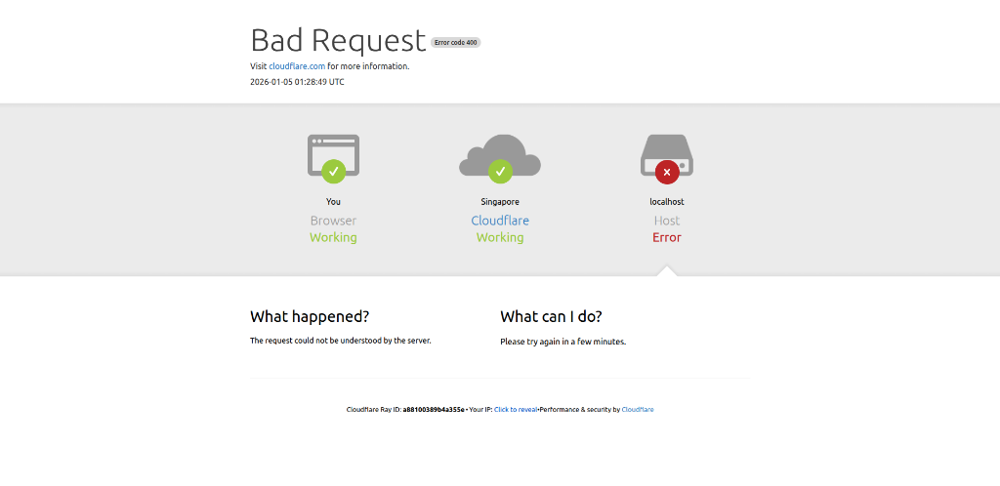
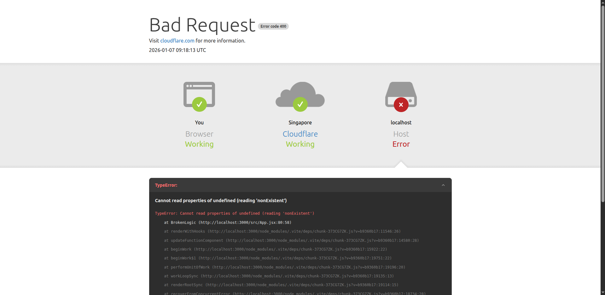

# Cloudmask

Cloudmask is a React library that provides a professional Cloudflare-style error page for your application when runtime crashes occur. It serves as a robust Error Boundary that catches component errors and displays a user-friendly interface instead of a blank screen or raw error logs.




Repository: https://github.com/NguyenDuc2309/cloudmask

## Project Goals

- **Runtime Crash Handling**: Automatically catches React component errors via a standardized Error Boundary.
- **Professional UI**: Replicates the clean and recognizable Cloudflare error page design, including status codes, Ray IDs, and timestamps.
- **Automatic Error Detection**: Intelligently analyzes error objects to determine appropriate HTTP status codes (e.g., 400 for logic errors, 502 for runtime crashes).

## Installation

```bash
npm install cloudmask
```

## Usage

Wrap your application (or specific parts of it) with `CloudmaskErrorBoundary`.

### Import Style

Ensure the library's CSS is imported in your entry file (e.g., `main.jsx` or `index.jsx`):

```javascript
import "cloudmask/style.css";
```

### Wrap Application

```jsx
import React from "react";
import { CloudmaskErrorBoundary } from "cloudmask";
import App from "./App";

const Root = () => (
  <CloudmaskErrorBoundary serviceName="My App">
    <App />
  </CloudmaskErrorBoundary>
);

export default Root;
```

When any component within the boundary crashes, Cloudmask will intercept the error and display the error page.

## Props

The `CloudmaskErrorBoundary` component accepts the following optional prop:

| Prop          | Type      | Default        | Description                                        |
| ------------- | --------- | -------------- | -------------------------------------------------- |
| `serviceName` | `string`  | `"Cloudflare"` | The name of the service displayed in the error UI. |
| `isDev`       | `Boolean` | `"false"`      | Turn on to show developer error.                   |

## Automatic Error Detection Logic

Cloudmask analyzes the captured `Error` object to categorize the failure:

### 400 Bad Request

Assigned to errors likely caused by development logic issues:

- `TypeError` (e.g., accessing a property of undefined)
- `ReferenceError` (e.g., using an undeclared variable)
- `SyntaxError`

### 502 Bad Gateway

Assigned to generic runtime crashes:

- `new Error('Message')`
- General unhandled exceptions

### 500 Internal Server Error

Used as a fallback for all other error types.

---

Cloudmask - enhance your application's resilience with professional error handling.
